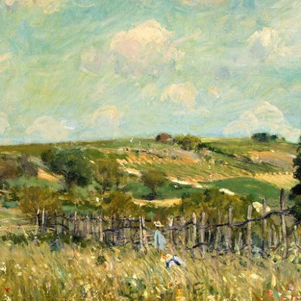
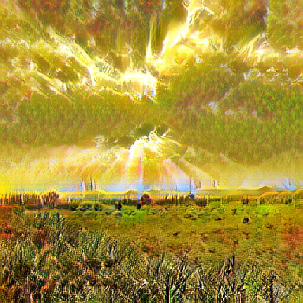
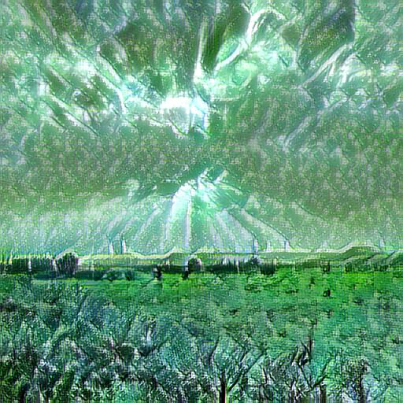

# alignimages
## examples
<table>
<tr align='center'>
<td>Contentment</td>
<td></td>
<td></td>
<td></td>
<td></td>
</tr>
<td>Excitement</td>
<td></td>
<td></td>
<td></td>
<td></td>
</tr>
<td>Fear</td>
<td></td>
<td></td>
<td></td>
<td></td>
</tr>
<td>Sadness</td>
<td></td>
<td></td>
<td></td>
<td></td>
</tr>

<table>
<tr align='center'>
<td>Sentiment</td>
<td>Content</td>
<td>Ours</td>
<td>Gatys et al.</td>
<td>Ulyanov et al.</td>
<td>Chen and Schmidt</td>
</tr>
<tr>
<td></td>
<td></td>
<td></td>
<td></td>  
<td></td>  
<td></td>  
</tr>
<td></td> 
<td></td> 
<td></td> 
<td></td>  
<td></td>  
<td></td> 
</tr>
<td></td> 
<td></td> 
<td></td> 
<td></td>
<td></td>
<td></td> 
</tr>
<td></td> 
<td></td>
<td></td> 
<td></td> 
<td></td> 
<td></td> 
</tr>
<td></td>
<td></td>
<td></td>
<td></td>
<td></td>
<td></td>
</tr>
</table>

## Excitement sentiment

<table>
<tr>
<td><content||sentiment></td>
<td></td>
<td></td>
<td></td>
<td></td>
<td></td>
<tr>
<td></td>
<td></td>
<td></td>
<td></td>
<td></td>
<td></td>
<tr>
<td></td>
<td></td>
<td></td>
<td></td>
<td></td>
<td></td>
<tr>
<td></td>
<td></td>
<td></td>
<td></td>
<td></td>
<td></td>
<tr>
<td></td>
<td></td>
<td></td>
<td></td>
<td></td>
<td></td>
<tr>
<td></td>
<td></td>
<td></td>
<td></td>
<td></td>
<td></td>
<tr>
</table>
